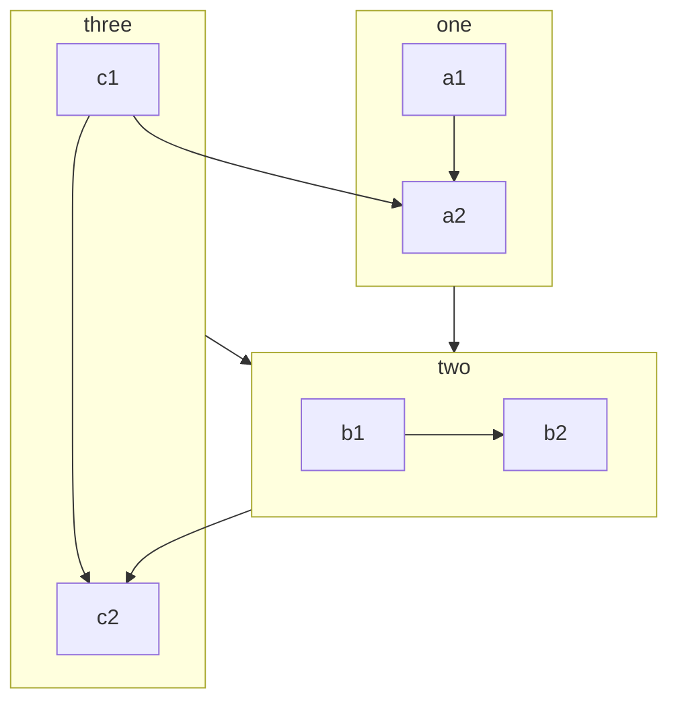

# Demo for page-01

## LaTeX

$$
\LaTeX \oiiint_\Sigma
$$

## Badge & Footnote

*@recommend* All of VuePress2 is ready![^1]

[^1]: footnote!

## Container

::: warning

Solid is not Solid.js!

:::

## Image


## Mermaid



## Copy Code

```cpp
#include <iostream>

int main(int argc, char** argv) {
  std::cout << "Hello World!" << std::endl;
  return 0;
}
```
