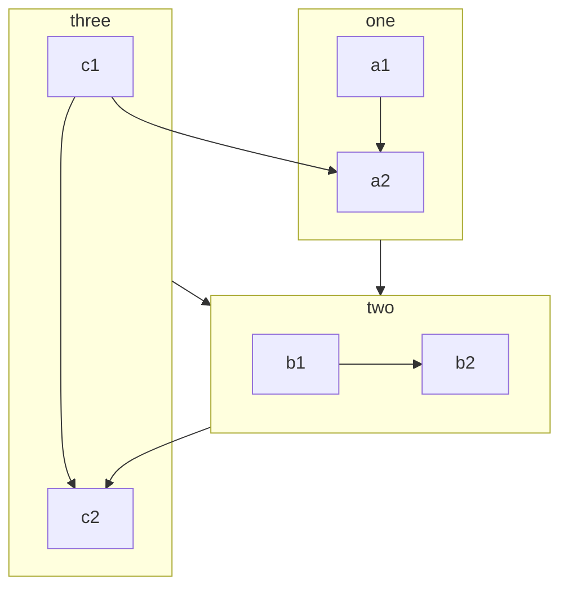

# Demo for page-01

## LaTeX

$$
\LaTeX \oiiint_\Sigma
$$

## Badge & Footnote

*@recommend* All of VuePress2 is ready![^1]

`code` is `code`!

[^1]: footnote!

## Container

> [!WARNING]
> Solid is not Solid.js!

## Image


## Mermaid



## Copy Code

```cpp
#include <iostream>

int main(int argc, char** argv) {
  std::cout << "Hello World!" << std::endl;
  return 0;
}
```

## Tabs

::: tabs

@tab title 1

$$
\oint
$$

@tab title 2

$$
\oiint
$$

@tab:active title 3

$$
\oiiint
$$

:::
